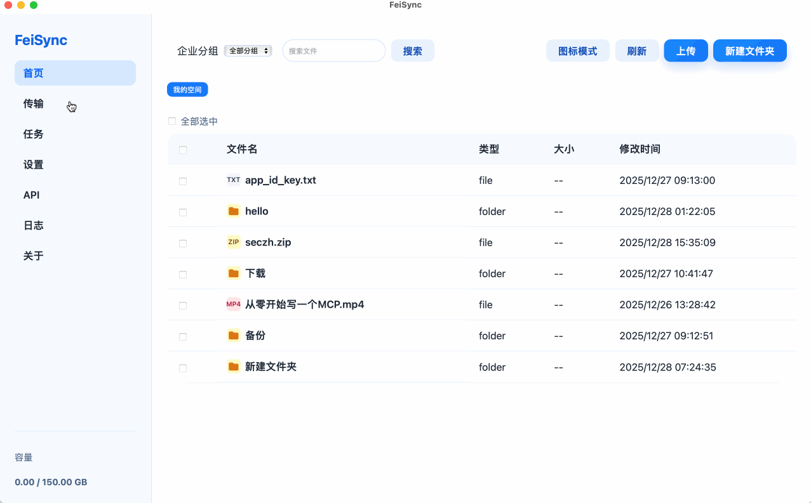
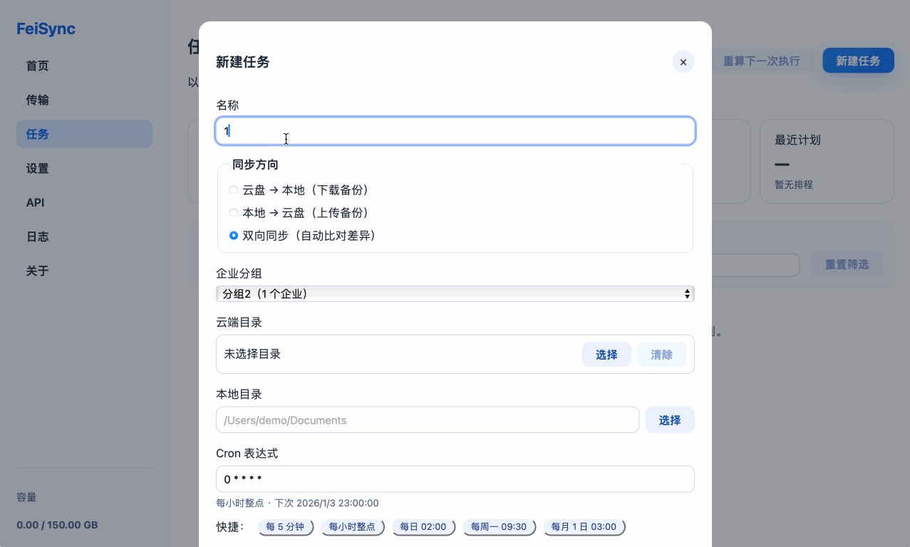
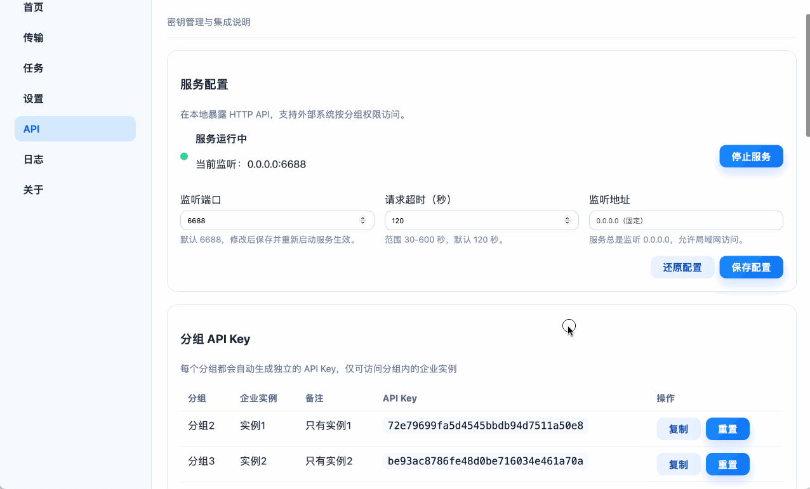

# FeiSync

FeiSync 是基于 Tauri + Vue3 的跨平台桌面客户端，用于管理 Lark/飞书云空间。后端使用 Rust 封装官方 API，前端使用 Pinia 管理状态，实现多企业账号、文件浏览、搜索、上传/下载和断点续传。

## 主要特性
  - 多企业实例：支持配置多个 app_id/app_secret，按分组筛选，自动在容量不足时切换实例。
  - 云盘浏览：首页提供列表/图标模式、排序、面包屑导航、全局搜索、批量操作、拖拽上传/移动。
  - 传输中心：展示上传/下载队列，支持暂停、恢复、取消、失败重试以及断点续传，速度/剩余时间实时刷新。
  - 内部自动匹配企业实例与资源 token，外部无需关心租户切换。
  - 支持单向/双向同步的基于cron的定时任务
  - 开放API供第三方调用

## 截图




## 目录结构
```
feisync/
├── package.json          # 前端依赖配置
├── src/                  # Vue3 + Pinia 前端代码
├── src-tauri/            # Rust 后端 + Tauri 配置
├── feisync.tenants.json  # 本地存储的企业实例列表（运行后生成/更新）
└── README.md
```

## 初始化/运行
```bash
cd feisync
npm install
npm run tauri:dev
```
